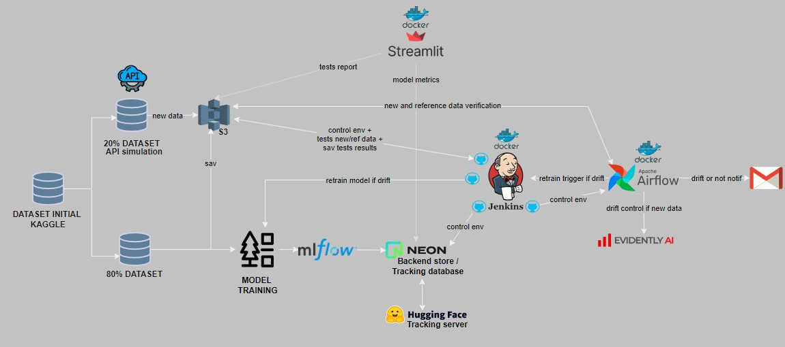

# 🌲 Forest Cover Type MLOps Pipeline


## 🗃️ Overview

Automated MLOps pipeline for Forest Cover Type prediction, featuring continuous integration, deployment, monitoring, and retraining capabilities.

The project is divided into several key parts, each managed by different team members:

- **Kevin**: Responsible for data ingestion, model training, versioning with MLflow, and API development.
- **Anne**: In charge of monitoring and testing using Jenkins.
- **Romain**: Focused on production deployment, using Airflow and Evidently.ai for automated tasks and Streamlit dashboard.

- Project theme: https://www.kaggle.com/datasets/uciml/forest-cover-type-dataset

---

## 🏰 Architecture



- **Data Storage**: AWS S3  
- **Model Tracking**: MLflow (HuggingFace Server)  
- **Database**: NeonDB  
- **Orchestration**: Airflow  
- **CI/CD**: Jenkins  
- **Monitoring**: Evidently.ai  
- **Dashboard**: Streamlit  

---

## 🚀 Quick Start

### Prerequisites

- Docker and Docker Compose  
- AWS Account  
- NeonDB Account  
- HuggingFace Account  
- Evidently.ai Account  

### Setup

1. **S3 Bucket Structure**

```bash
s3://S3bucket_name/covertype/
├── mlflow_artifact/
├── models/
│   └── model.pkl
├── new_data/
│   └── covtype_20.csv
│   └── covtype_sample_drift.csv
├── prediction/
├── reference/
│   └── covtype_80.csv
├── test_reports/
│   └── test_report_xxxxx.csv
```

2. **Environment Setup**

```bash
# Clone repository
git clone https://github.com/Rom1Legrand/IAI-B4-MLops_pipeline_CoverTypeForest.git
cd IAI-B4-MLops_pipeline_CoverTypeForest

# Configure environment variables in `.env` and `.secrets` files as shown above.
```

3. **Launch Services**

```bash
docker-compose build
docker-compose up -d
```

---

## 🔄 Pipeline Flow

### Data Ingestion
- Monitor S3 for new data (e.g., `covtype_20.csv` or `covtype_sample_drift.csv` for tests).
- Trigger drift detection.

### Drift Detection
- Evidently.ai analyzes data drift.  
- Email notifications for drift status.  
- Trigger retraining if drift is detected.  

### Model Training
- RandomForest model for training.  
- Jenkins executes the training pipeline.  
- MLflow tracks metrics and parameters.  
- Model artifacts stored on S3.  

### Monitoring
- Streamlit dashboard displays metrics.  
- Test results visualization.  
- Performance tracking.  

---

## 🔧 Components

### Jenkins Pipelines
- Environment setup.  
- Model testing.  
- Retraining triggers.  

### Airflow DAGs
- Data drift monitoring.  
- Email notifications.  
- Jenkins pipeline triggers.  

### Streamlit Dashboard
- Model metrics display.  
- Test results visualization.  
- Drift analysis.  

---

## 🖥️ API Integration

### API Overview

A custom API was developed to simulate real-time data ingestion for the pipeline, enabling robust testing and dynamic updates.

#### Features:
- Simulates the injection of new data into the S3 bucket (`covtype_20.csv` and drift samples).  
- Respects the original dataset schema and format.  
- Periodically uploads new data to trigger pipeline actions.  
- Integrated seamlessly with Airflow and Jenkins for end-to-end automation.  

#### API Endpoints:

- **`POST /generate`**  
  Upload new simulated data into the S3 bucket.   

---

## 📊 Data

Dataset: [Forest Cover Type](https://archive.ics.uci.edu/static/public/31/covertype.zip)

- Training: 80% (covtype_80.csv)  
- Testing: 20% (covtype_20.csv)  

---

## 👥 Team

- **Kevin**: Data ingestion, model training, versioning with MLflow, and API development.  
- **Anne**: Monitoring, Jenkins testing.  
- **Romain**: Deployment, Airflow, Streamlit.

---
